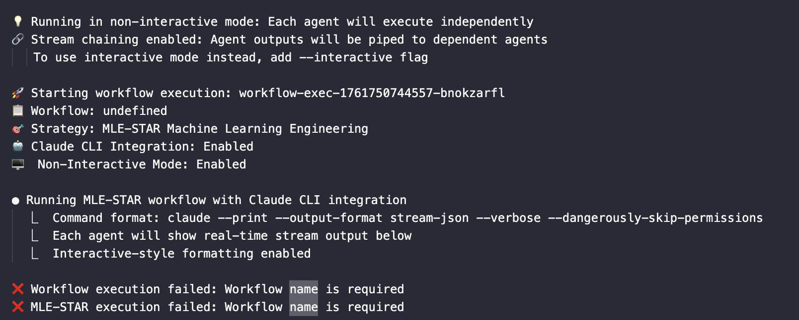

# Welcome 
Hi, I'm YuChen Chiu. 

This project will going to use the paper written by google cloud team to practice **Machine Learning Engineering Agent via Search and Targeted Refinement Workflow** by two approaches below:

1. Langgraph + Ollama in Multi-Agent System
2. Claude-Flow Service in Sales Prediction Workflow


## 1️⃣ Langgraph + Ollama in Multi-Agent System
### 📚 Reference
* [Paer Reading - Google Cloud - MLE-STAR: Machine Learning Engineering Agent via Search and Targeted Refinement](https://arxiv.org/abs/2506.15692v3) 
* [Github Ruvnet/Claude-Flow](https://github.com/ruvnet/claude-flow)
* [Github Claude-Flow Agent System Overview](https://github.com/ruvnet/claude-flow/wiki/Agent-System-Overview)
* [Web Search example - Langgraph with Ollama](https://github.com/john-adeojo/graph_websearch_agent)

### 📁 Practice Dataset
* [Rossmann Store Sales Prediction](https://www.kaggle.com/competitions/rossmann-store-sales/)

### 🤖 Machine‑Learning AI Agent Framework and Concepts

#### (一) System Workflow

Overview of MLE-STAR

(a) **AI Research stage**: MLE-STAR use **Web Search** to retrieves task-specific models to generate an initial solution.

(b) **Outer Loop: Target Issue stage**: Find out which target code block of ML components can be better via [**ablation study**](https://blog.csdn.net/flyfish1986/article/details/104812229).

(c) **Inner Loop: Code Block Refinement**: Iteratively refine the target code block until where the improved solution of inner loop becomes the latest solution in outer loop.


#### (二) Workflow in Langgraph Multi-Agent System
1. **Web Search**：Search for latest model 
2. **Deep Research**：Analyze model algorithm and example code
3. **Code Generation**：Initial solution version 1
4. **Model Evaluation**：
5. **Code Refinement**：
6. **Solution Refinement**：Refine model and codes
7. **Summary Report**：Summarize final solution


### 🔧 Tool ExplanationWeb 

#### (一) Model Configuration

#### (二) DuckDuckGo Search Engine

Due to the resource limitation, so choose duckduckgo search engine as web search method


## 2️⃣ Claude-Flow Service in Sales Prediction Workflow

> contents

### Some Issues
1. In Claude-flow github repo doesn't mention MLE-STAR, but the wiki page does. This suggests MLE-STAR might be an experimental or incomplete feature. Let me verify the wiki page exists and check if there's a specific alpha version.
    1. github repo <main> 屬於 v2.7.12
    2. mle-star framework (alpha version) 是在 v2.7.26 中

    3. ✅ Finally Fix it with claude code. Now can try in command line interface.
    ``` bash
    # Using Python wrapper
    python3 call_claude_flow_tool.py --dataset data/train.csv --target Sales --output ./models/ --name "sales-prediction"

    # Or directly with claude-flow CLI
    claude-flow automation mle-star --dataset data/train.csv --target Sales --claude --name "my-experiment"
```