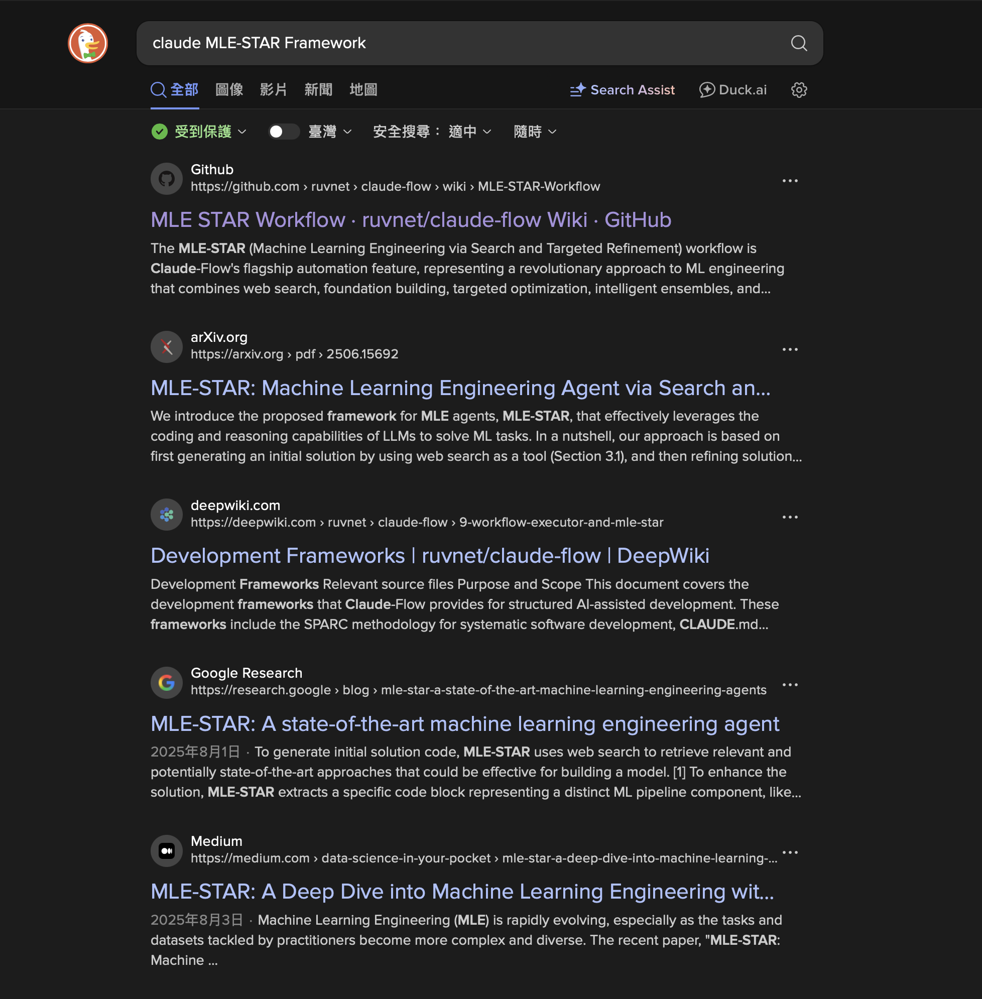

# Welcome 
Hi, I'm YuChen Chiu. 

This project will going to use the paper written by google cloud team to practice **Machine Learning Engineering Agent via Search and Targeted Refinement Workflow** by two approaches below:

1. Langgraph + Ollama in Multi-Agent System
2. Claude-Flow Service in Sales Prediction Workflow

## 📚 Reference
* Paer Reading
    * [Google Cloud - MLE-STAR: Machine Learning Engineering Agent via Search and Targeted Refinement](https://arxiv.org/abs/2506.15692v3) 
* Claude-Flow
    * [Github Repo](https://github.com/ruvnet/claude-flow)
    * [Wiki to understand the detail concepts)](https://github.com/ruvnet/claude-flow/wiki/Agent-System-Overview)
* Code Examples
    * [Web Search example - Langgraph with Ollama](https://github.com/john-adeojo/graph_websearch_agent)

## 📁 Practice Dataset
* [Rossmann Store Sales Prediction](https://www.kaggle.com/competitions/rossmann-store-sales/)


## 1️⃣ Langgraph + Ollama in Multi-Agent System
### Basic Information
1. Branch Name：[**main**](https://github.com/ianchiu111/Google-MLE-STAR/tree/main)


### 🤖 Machine‑Learning AI Agent Framework and Concepts

#### (一) Workflow in Langgraph Multi-Agent System
1. **Web Search**：Search for latest model 
2. **Deep Research**：Analyze model algorithm and example code
3. **Code Generation**：Initial solution version 1
4. **Model Evaluation**：
5. **Code Refinement**：
6. **Solution Refinement**：Refine model and codes
7. **Summary Report**：Summarize final solution


### 🔧 Tool ExplanationWeb 

#### (一) DuckDuckGo Search Engine

Due to the resource limitation, so choose duckduckgo search engine as web search method




## 2️⃣ Claude-Flow Service in Sales Prediction Workflow

### Repo Information
1. Branch：[**claude-flow/dev_main**](https://github.com/ianchiu111/Google-MLE-STAR/tree/claude-flow/dev_main)
2. Repo Architecture
```plaintext
/Users/yuchen/Google-MLE-Agent/
├── .memoryignore/                          ⭐ Testing Records
├── data/                                   ⭐ Rossmann Sales Predictioin Dataset
│   ├── data_cleaning.ipynb.                ⭐ Analyze Raw Dataset Myself
│   ├── train.csv                           
│   ├── test.csv
│   ├── store.csv
│   └── sample_submission.csv
├── images/                                 ⭐ Images for README.md
├── models/                                 ⭐ AModel output directory
├── src/
│   └── cli/
│       └── simple-commands/
│           └── templates/
│               └── mle-star-workflow.json  ⭐ Template to interact with claude-flow by CLI
├── .gitignore                              ⭐ Files should be ignored when processing git
├── Google-MLE-Agent.pdf                    ⭐ Google MLE_STAR Paper
└── README.md                               ⭐ README Documentation
```

### System Information

#### 1️⃣ System Workflow

Overview of MLE-STAR Framework.

(a) **AI Research stage**: MLE-STAR use **Web Search** to retrieves task-specific models to generate an initial solution.

(b) **Outer Loop: Target Issue stage**: Find out which target code block of ML components can be better via [**ablation study**](https://blog.csdn.net/flyfish1986/article/details/104812229).

(c) **Inner Loop: Code Block Refinement**: Iteratively refine the target code block until where the improved solution of inner loop becomes the latest solution in outer loop.


#### 2️⃣ Build Claude-Flow Template
> Note 1: Before using claude-flow CLI, clean the output folder to avoid unaccurate.
1. [`claude-flow automation mle-star [options]`](https://github.com/ruvnet/claude-flow/wiki/MLE-STAR-Workflow#-complete-mle-star-options)


* Required:
  * --dataset <path>          Path to dataset file (default: ./data/dataset.csv)
  * --target <column>         Target column name (default: target)
* Core Options:
    * --claude                  Enable Claude CLI integration (recommended)
    * --output <dir>            Model output directory (default: ./models/)
    * --name <experiment>       Experiment name for tracking
* Iteration Control:
    * --search-iterations <n>   Web search iterations (default: 3)
    * --refinement-iterations <n> Refinement cycles (default: 5)
    * --max-agents <n>          Maximum agents to spawn (default: 6)
* Execution Modes:
    * --interactive             Use interactive mode with master coordinator
    * --non-interactive         Force non-interactive mode (default)
    * --output-format <format>  Output format (stream-json enables chaining)
* Advanced:
    * --chaining                Enable stream-json chaining between agents
    * --no-chaining             Disable stream-json chaining
    * --timeout <ms>            Execution timeout (default: 4 hours)
    * --verbose                 Enable detailed logging
    * --no-claude-warning       Suppress Claude integration warnings

### 📝 Testing Record

#### MVP Test - 1 (**2 agents**)
* Claude-Flow Template: .memoryignore/mvp-testing-1/mle-star-workflow.json
* Command `claude-flow automation mle-star --dataset data/train.csv --target Sales --output models/ --refinement_iterations 2 --claude`

   | Task Phase | Task ID | Task Name | Agent ID | Agent Type | **Task Dependencies** |
   | --- | --- | --- | --- | --- | --- |
   | 1 | dataset_analysis | Dataset Analysis & Profiling | foundation_agent | coder | **None** |
   | 2 | targeted_refinement | Iterative Component Refinement | refinement_agent | optimizer | **dataset_analysis** |

* Processing Result Summary

   

* Issues & Solutions
   1. `❌ Workflow execution failed: Circular dependency detected or invalid dependencies` error occurs **due to the setup of the agent workflow**. ➡️ Check template configuration `depends` in `tasks` = `dependencies` 
   2. `❌ Workflow execution failed: Task model_deployment_prep assigned to unknown agent: orchestrator` error occurs **due to the setup of agent initialization** ➡️ Check template configuration `id` + `type` in `agents` = `assignTo` in `tasks`
   3. ❌ claude-flow read every files on the root due to the original **ReasoningBank + hooks** memory machenism  ➡️ Prompt Engineering to avoid reading specific files and folders.
      - `npx claude-flow memory search 'agent/*'` read all files generated by agents
      - `Glob: **/*.json, **/*analyst*.json` to read all json files
      - `Glob: **/*.csv` to read all csv files


   <p style="text-align: left; font-size: 20px;">🆚 Comparasion with prompt engineering</p>

   |  |  |
   | --- | --- |
   | 🔧 **prompt engineering** | ADD `Please ignore .memoryignore folder when processing the dataset.` in `description` for each agent in `tasks`  |
   | ❌ **without prompt-engineering** |  |
   | ✅ **with prompt-engineering** |  |


---

#### MVP Test - 2 (**3 agents** + **parallel processing** + **New Options in Command**)
* Claude-Flow Template: .memoryignore/mvp-testing-2/mle-star-workflow.json
* Command `claude-flow automation mle-star --dataset data/train.csv --target Sales --search_iterations 3 --nums_solutions 5 --task_description "please use the train.csv dataset and target column to predict sales revenue" --refinement_iterations 2 --claude`

   | Task Phase | Task ID | Task Name | Agent ID | Agent Type | **Task Dependencies** |
   | --- | --- | --- | --- | --- | --- |
   | 1-1 | web_search | Web Search for SOTA Approaches | research_agent | researcher | **None** |        
   | 1-2 | dataset_analysis | Dataset Analysis & Profiling | foundation_agent | coder | **None** |
   | 2 | targeted_refinement | Iterative Component Refinement | refinement_agent | optimizer | **[dataset_analysis, web_search]** |

* Processing Result Summary

   

* Issues & Solutions
1. ❓ In MVP Test - 1, Only **Dataset Analysis & Profiling truly works via Origin Json Template in Github Repo**, so I add new agent and work phase with my own variables according to the MLE-STAR workflow ➡️ We can see from both Processing Result Summary, working with 2 phases and 2 agents.
2. ❓ As a claude pro version user, I spend 38% sessioins to finish the workflow only with 2 phases. It's affraid not to finish MLE-STAR workflow with original workflow json template. ➡️ Try to work it in a lightweighted version in next test.

   


### Some Issues I Found
1. `Errors: task_execution: Process exited with code 1` means token is out of limitation
2. claude-flow github repo is **v2.7.12**, but MLE_STAR workflow alpha version appears in **v2.7.26**. <2025/10/30>
3. Claude-Flow doesn't support open model source to set into **src/cli/simple-commands/templates/mle-star-workflow.json** yet, so this practice still need to use claude-flow CLI to practice MLE_STAR workflow. <2025/10/30>
4. Because all the agents use same memory + Use the `"${task_id.output.parameter}"` setup to ensure the chats between agents are clean enough. <2025/10/31>
