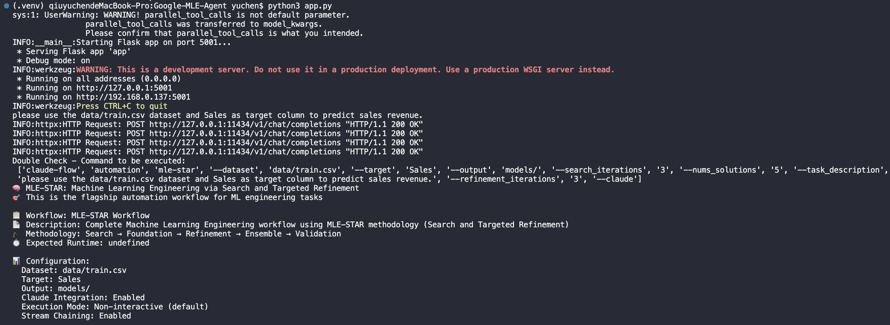
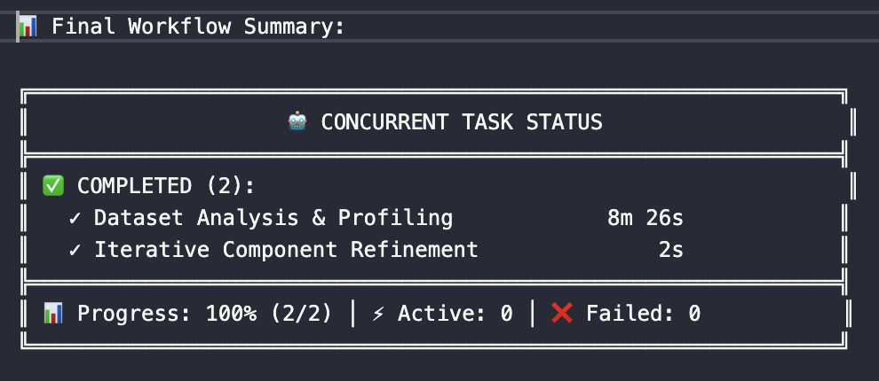
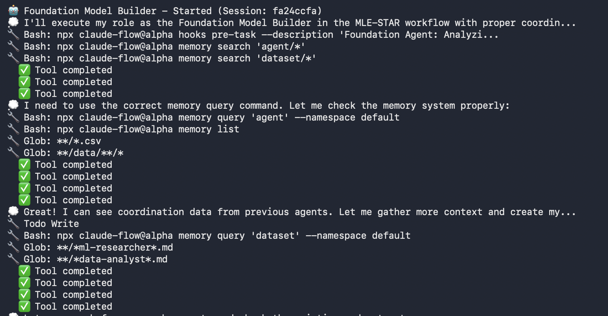
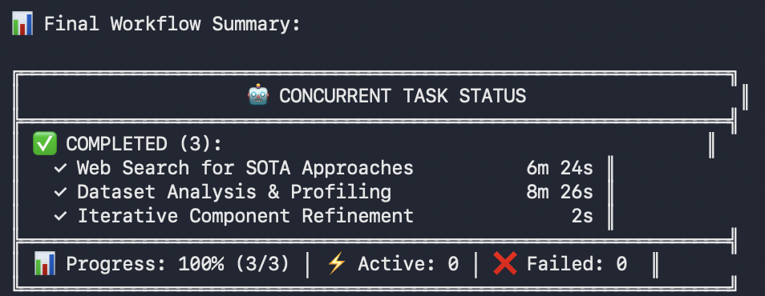
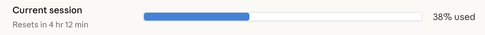

# Welcome 
Hi, I'm YuChen Chiu. 

This project will going to use the paper written by google cloud team to practice **Machine Learning Engineering Agent via Search and Targeted Refinement Workflow** by two approaches in different branches below:

1. [**Claude-Flow Service**](https://github.com/ianchiu111/Google-MLE-STAR/tree/claude-flow/dev_main)
2. [**Langgraph + Ollama in Multi-Agent**](https://github.com/ianchiu111/Google-MLE-STAR/tree/main)

## ⚡️ Quick Start

📋 Prerequisites
1. Node.js 18+ (LTS recommended)
2. npm 9+ or equivalent package manager

⚠️ Claude Code
```bash
# 1. Install Claude Code globally
npm install -g @anthropic-ai/claude-code

# 2. (Optional) Skip permissions check for faster setup
claude --dangerously-skip-permissions
```

🔧 Python Environment
```bash
# 1. Create python environment
pip install -r requirements.txt
```

🤖 Ollama Model
```bash
# 1. Pull ollama model
ollama pull qwen2.5:7b-instruct

# 2. Initialize the Ollama daemon service
ollama serve

# 3. Verify service status
ollama list
```

✅ Working Demo
```bash
# 1. Start the server
python app.py

# 2. Send a POST request
POST http://localhost:5001/api/claude-flow/v1
{
    "query": "please use the data/train.csv dataset and Sales as target column to predict sales revenue."
}

# 3. Check the terminal output
```




## 📚 Reference
* Paer Reading
    * [Google Cloud - MLE-STAR: Machine Learning Engineering Agent via Search and Targeted Refinement](https://arxiv.org/abs/2506.15692v3) 
* Claude-Flow
    * [Github Repo](https://github.com/ruvnet/claude-flow)
    * [Wiki to understand the detail concepts)](https://github.com/ruvnet/claude-flow/wiki/Agent-System-Overview)
* Code Examples
    * [Web Search example - Langgraph with Ollama](https://github.com/john-adeojo/graph_websearch_agent)

## 📁 Practice Dataset
* [Rossmann Store Sales Prediction](https://www.kaggle.com/competitions/rossmann-store-sales/)


## 📌 Claude-Flow Service in Sales Prediction Workflow

### Repo Architecture
```plaintext
/Users/yuchen/Google-MLE-Agent/
├── .memoryignore/                          ⭐ Testing Records
│   ├── mvp-testing-1
│   └── mvp-testing-2
├── data/                                   ⭐ Rossmann Sales Predictioin Dataset
│   ├── data_cleaning.ipynb.                
│   ├── train.csv                           
│   ├── test.csv
│   ├── store.csv
│   └── sample_submission.csv
├── images/                                 
├── models/                                 ⭐ Claude-Flow agent output directory
├── Prompts/
│   └── specialized_agent_prompt.py         ⭐ Agent prompts in langgraph swarm framework
├── src/
│   └── cli/
│       └── simple-commands/
│           └── templates/
│               └── mle-star-workflow.json  ⭐ Template to interact with claude-flow by command
├── Tools/
│   └── claudeFlow_agent_tool.py            ⭐ Defined tool to run <claude-flow automation> command
├── .gitattributes                          
├── .gitignore                              
├── Google-MLE-Agent.pdf                    ⭐ Google MLE_STAR Paper
├── graph.py                                ⭐ Langgraph Graph
├── app.py                                  ⭐ Entry point with natural language to test mle-star workflow
├── README.md                               
└── requirements.txt                        ⭐ Python Environment
```

### System Workflow

Overview of MLE-STAR Framework.


## 📝 Demo Progress

### MVP Test - 1

* Testing Goal：
    * Utilize 2 agents
* Claude-Flow Template：
    * `.memoryignore/mvp-testing-1/mle-star-workflow.json`
* Command：
    * `claude-flow automation mle-star --dataset data/train.csv --target Sales --output models/ --refinement_iterations 2 --claude`

   | Task Phase | Task ID | Task Name | Agent ID | Agent Type | **Task Dependencies** |
   | --- | --- | --- | --- | --- | --- |
   | 1 | dataset_analysis | Dataset Analysis & Profiling | foundation_agent | coder | **None** |
   | 2 | targeted_refinement | Iterative Component Refinement | refinement_agent | optimizer | **dataset_analysis** |

* Processing Result Summary

   

* Issues & Solutions
   1. `❌ Workflow execution failed: Circular dependency detected or invalid dependencies` error occurs **due to the setup of the agent workflow**. ➡️ Check template configuration `depends` in `tasks` = `dependencies` 
   2. `❌ Workflow execution failed: Task model_deployment_prep assigned to unknown agent: orchestrator` error occurs **due to the setup of agent initialization** ➡️ Check template configuration `id` + `type` in `agents` = `assignTo` in `tasks`
   3. ❌ claude-flow read every files on the root due to the original **ReasoningBank + hooks** memory machenism  ➡️ Prompt Engineering to avoid reading specific files and folders.
      - `npx claude-flow memory search 'agent/*'` read all files generated by agents
      - `Glob: **/*.json, **/*analyst*.json` to read all json files
      - `Glob: **/*.csv` to read all csv files


   <p style="text-align: left; font-size: 20px;">🆚 Comparasion with prompt engineering</p>

   |  |  |
   | --- | --- |
   | 🔧 **prompt engineering** | ADD `Please ignore .memoryignore folder when processing the dataset.` in `description` for each agent in `tasks`  |
   | ❌ **without prompt-engineering** |  |
   | ✅ **with prompt-engineering** |  |


---

### MVP Test - 2 
* Testing Goal：
    * Utilize 3 agents
    * Try parallel processing
    * New Options in Command
* Claude-Flow Template：
    * `.memoryignore/mvp-testing-2/mle-star-workflow.json`
* Command：
    * `claude-flow automation mle-star --dataset data/train.csv --target Sales --search_iterations 3 --nums_solutions 5 --task_description "please use the train.csv dataset and target column to predict sales revenue" --refinement_iterations 2 --claude`

   | Task Phase | Task ID | Task Name | Agent ID | Agent Type | **Task Dependencies** |
   | --- | --- | --- | --- | --- | --- |
   | 1-1 | web_search | Web Search for SOTA Approaches | research_agent | researcher | **None** |        
   | 1-2 | dataset_analysis | Dataset Analysis & Profiling | foundation_agent | coder | **None** |
   | 2 | targeted_refinement | Iterative Component Refinement | refinement_agent | optimizer | **[dataset_analysis, web_search]** |

* Processing Result Summary

   

* Issues & Solutions
1. ❓ In MVP Test - 1, Only **Dataset Analysis & Profiling truly works via Origin Json Template in Github Repo**, so I add new agent and work phase with my own variables according to the MLE-STAR workflow ➡️ We can see from both Processing Result Summary, working with 2 phases and 2 agents.
2. ❓ As a claude pro version user, I spend 38% sessioins to finish the workflow only with 2 phases. It's affraid not to finish MLE-STAR workflow with original workflow json template. ➡️ Try to work it in a lightweighted version in next test.

   


### Final Version
* Goal:
    * Set the workflow as a defined tool
    * Natural Language in -> Mission summary out
    * Utilize 7 agents in 5 work phase to practice whole mle-star workflow
* Claude-Flow Template:
    * `src/cli/simple-commands/templates/mle-star-workflow.json`
* Modify command based on user query

* Processing Result Summary

   

## 🔍 Issues
1. `Errors: task_execution: Process exited with code 1` means token is out of limitation
2. claude-flow github repo is **v2.7.12**, but MLE_STAR workflow alpha version appears in **v2.7.26**. <2025/10/30>
3. Claude-Flow doesn't support open model source to set into **src/cli/simple-commands/templates/mle-star-workflow.json** yet, so this practice still need to use claude-flow CLI to practice MLE_STAR workflow. <2025/10/30>
4. Because all the agents use same memory + Use the `"${task_id.output.parameter}"` setup to ensure the chats between agents are clean enough. <2025/10/31>
